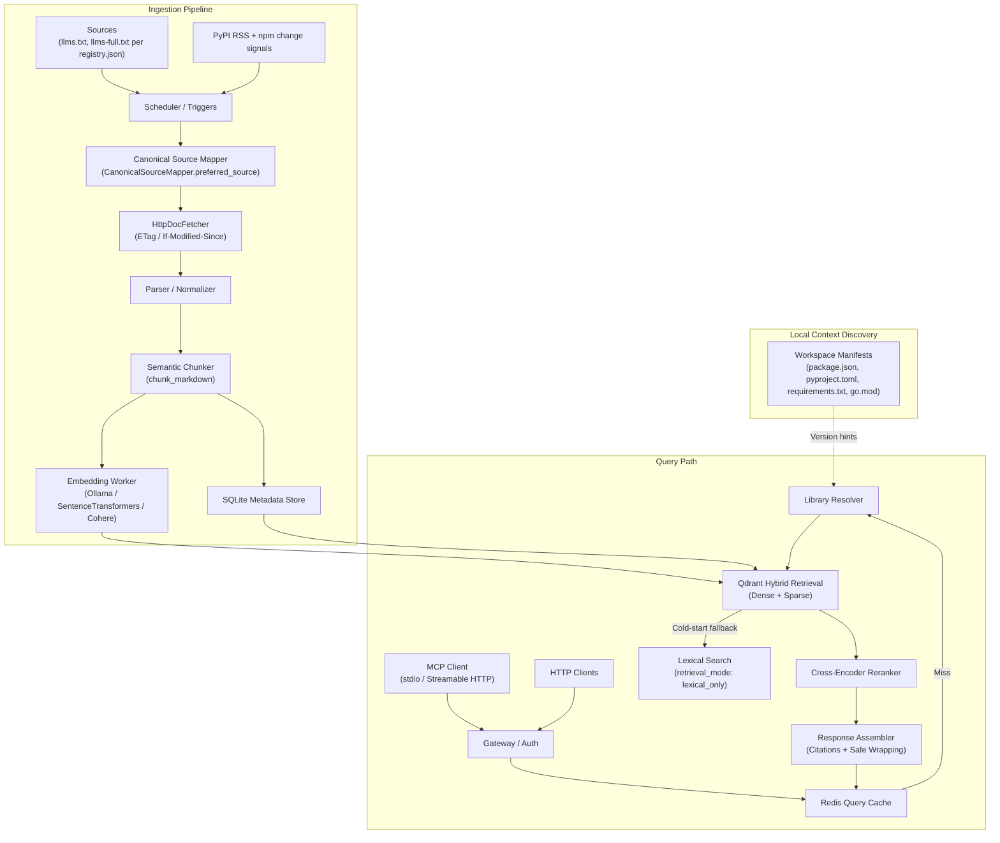

# Architecture Plan: Context7-Like Documentation Retrieval Platform

## Document Control

- Status: v7 (Build-Aligned)
- Date: 2026-03-20
- Owner: Product + Platform Engineering
- Target output: production-grade documentation retrieval platform with the same purpose as Context7

---

## Executive Summary

This document defines the product, business, and technical architecture for a documentation retrieval platform whose purpose matches Context7: give coding agents and developers reliable, version-aware, citation-friendly access to high-quality technical documentation through MCP and HTTP APIs.

The platform is not a generic search engine and not a general-purpose chatbot. Its job is to resolve a library or framework, retrieve the most relevant documentation sections for a concrete implementation question, and return structured context that can be injected into an LLM workflow.

### Key Architectural Pillars

- Unified hybrid search: Qdrant combining dense and sparse retrieval as the standard retrieval engine, with lexical fallback for cold-start.
- Registry-driven freshness: `llms.txt` / `llms-full.txt` as primary source format, with conditional HTTP (ETag / If-Modified-Since) to skip unchanged content.
- Auto-context discovery: MCP `initialize` extracts workspace path from `workspaceFolders`, `rootUri`, or `project_path` and bootstraps the project automatically.
- Dual-plane architecture: SaaS control plane on PostgreSQL/Supabase, local data plane on SQLite.
- High-level MCP tools for low-latency agent use with lower-level tools retained for debugging.
- SaaS-ready control plane for authentication, workspaces, billing, quotas, and hosted MCP access.

### Product Purpose Statement

Given a coding question, return the most relevant, version-correct, trusted documentation context for the specific library or framework involved.

---

## Current Build State (as of 2026-03-20)

This section records what is implemented and working. Use it to distinguish built components from planned work below.

### What is built

**MCP stdio server** — fully working. Speaks JSON-RPC over stdin/stdout (protocol `2025-03-26`). Handles all ten tools: `scan_docs`, `list_project_updates`, `ack_project_updates`, `read_doc`, `read_full_page`, `search_docs`, `search_documentation`, `list_supported_libraries`, `install_project`, `fetch_docs`. Tool errors are caught and returned as proper JSON-RPC error responses.

**Auto-bootstrap on `initialize`** — working. The server reads `workspaceFolders`, `rootUri`, or `project_path` from `initialize.params`, resolves the workspace path, detects technologies from `package.json` / `pyproject.toml`, creates the project subscription, copies cached docs, and runs an initial scan — all before the first tool call.

**Technology detection** — working. Scans `package.json`, `pyproject.toml`, and `requirements.txt`. Maps detected package names to canonical library IDs via the seed registry.

**Seed registry** — 17 libraries in `src/ingestion/registry.json`: nextjs, react, vercel-ai-sdk, typescript, tailwindcss, vite, shadcn-ui, fastapi, pydantic, sqlalchemy, pytest, langchain, openai, anthropic, supabase, huggingface-transformers, docker. Each entry has `library_id`, `display_name`, `package_names`, and `sources` (preferring `llms-full.txt`).

**HTTP doc fetcher** — working. `HttpDocFetcher` in `src/ingestion/http_fetcher.py` fetches from web sources using conditional HTTP. `fetch()` raises on error; `fetch_all()` catches per-technology errors as `{"fetched": False, "error": True, ...}` and continues. `fetch_state` is persisted per technology in SQLite (ETag, Last-Modified, last_fetched_at, status_code, bytes).

**`fetch_docs` MCP tool** — working. Calls `DocsHubService.fetch_docs(technology?)` which constructs `HttpDocFetcher`, fetches, re-scans, and returns `{"fetch_results", "scan_summary"}`.

**CLI fetch commands** — working. `python -m buonaiuto_doc4llm fetch [--technology T] [--interval N]` and `python -m buonaiuto_doc4llm watch-and-fetch [--interval N]` are available. `watch-and-fetch` combines filesystem watch + periodic HTTP fetch.

**Lexical search (default)** — working. `search_docs()` and `search_documentation()` use substring matching as the default retrieval path. Sufficient for exact-keyword queries; not semantic.

**Embedding providers** — implemented, not wired by default:
- `OllamaEmbeddingProvider` makes real HTTP calls to `/api/embeddings`. Available when `requests` is installed and a model name is set.
- `SentenceTransformersEmbeddingProvider` runs offline embeddings via `sentence-transformers`. Available when the library is installed.
- `DeterministicLocalEmbeddingProvider` (SHA-256 placeholder) remains as fallback for tests.

**DocIndexer** — implemented, not wired by default. `src/buonaiuto_doc4llm/indexer.py` chunks docs via `chunk_markdown()`, embeds, and upserts into Qdrant. Activated only when `DocsHubService(indexer=...)` is passed explicitly.

**`HybridRetriever`** — implemented, not wired by default. Falls back to lexical if `qdrant_client is None`. Full hybrid path (Qdrant dense + sparse) is unused until Qdrant is configured.

**Optional dependencies** — declared in `pyproject.toml`:
- `fetch` — `requests>=2.31`
- `embeddings-ollama` — `requests>=2.31`
- `embeddings-st` — `sentence-transformers>=2.7`
- `qdrant` — `qdrant-client>=1.9`
- `all` — all of the above

**SaaS stubs** — `src/api/mcp_http.py` (`HostedMCPGateway` with SSE) and `src/api/app.py` (`ApiService` with quota + Stripe) exist as stubs ready for Phase 2 implementation.

**Test coverage** — tests cover: registry loading, HTTP fetching, fetch_all resilience, Ollama embed, SentenceTransformers embed, DocIndexer, CLI fetch commands, MCP/service integration for fetch_docs, fetch_all error handling.

### What is missing before Phase 1 exit

The following are the concrete remaining gaps before the platform can be used as a reliable Context7 equivalent:

1. **Semantic search not activated by default.** `search_documentation()` uses substring matching. Qdrant + embeddings path exists but requires explicit `--embeddings` flag or manual `DocsHubService(indexer=...)` injection. Users get no semantic retrieval out of the box.
2. ~~**No MCP Streamable HTTP transport.**~~ **Implemented.** `serve-http` subcommand and `serve --http` flag start a FastAPI endpoint at `/mcp` using the MCP Streamable HTTP protocol. Claude Desktop and claude.ai connect via `http://127.0.0.1:8421/mcp`.
3. **No benchmark harness.** The Phase 1 exit criterion (MRR@10 ≥ 0.70) cannot be measured without a benchmark dataset and evaluation runner.
4. **Resolver priority is still incomplete.** `search_documentation()` now applies explicit `libraries: [{id, version}]` filters, but manifest-extracted version hints are not automatically injected when the caller omits `libraries`.
5. **No freshness signal from package registries.** PyPI RSS and npm change feed integration are planned but not started. Current freshness depends on periodic polling only.

---

## Scenario Description

### Primary Scenario: Agentic Workflow

An AI coding agent is asked: "How do I implement React Server Components with Vercel?"

1. The MCP server initializes inside the workspace. `workspaceFolders` from the `initialize` call resolves the project path.
2. Auto-bootstrap detects `package.json`, finds `react` and `next` dependencies, maps them to `react` and `nextjs` library IDs, and runs `install_project`.
3. The agent calls `search_documentation` with the query.
4. The resolver maps the request to canonical library IDs and applies local version information as a hint.
5. The retrieval engine searches inside the relevant documentation corpus.
6. Results are returned with citations and source metadata.

### Secondary Scenario: Enterprise Knowledge

A company ingests internal frameworks and private repositories, indexes them under workspace-scoped access control, and exposes them through the same MCP and HTTP interfaces.

### Tertiary Scenario: Documentation Freshness

A package publishes a new release. The platform detects it through package registry signals or source polling, maps it to the correct documentation source, ingests changes, and updates the searchable index.

---

## Business Analysis

### Market Problem

Coding assistants fail on real software work because:

- model knowledge is stale
- the wrong version is silently assumed
- framework-specific APIs are hallucinated
- generic search returns SEO content instead of canonical docs
- private and internal docs are not available in the same retrieval flow

### Target Customers

- Individual developers using coding assistants
- AI-first software teams
- Tool builders integrating documentation retrieval into IDEs and assistants
- Enterprise engineering organizations with private frameworks and internal docs

### Value Proposition

- fresher technical answers
- lower hallucination rates
- version-aware retrieval
- support for internal and external knowledge in one workflow
- explicit citations for trust and auditability

### Monetization Direction

- Free: public docs only, limited usage
- Pro: higher usage, hosted MCP access, saved workspaces
- Team: shared workspaces, private repo ingestion, RBAC
- Enterprise: SSO, private deployment, self-hosted model support including Ollama

### Key Product Metrics

- library resolution accuracy
- MRR@10 / nDCG@10
- citation correctness
- version-correctness rate
- query latency
- freshness lag after source updates
- free-to-paid conversion

---

## Architecture Overview

### Core Architectural Decision

Use Qdrant as the default retrieval engine. For cold-start (no dense vectors yet), fall back to lexical-only retrieval and annotate responses with `retrieval_mode: lexical_only`. Keep Vespa as a future scale-out option.

### Planes

#### 1. Control Plane

Technology:
- PostgreSQL or Supabase Postgres
- Alembic migrations
- PgBouncer (transaction mode)

Responsibilities:
- users, workspaces, memberships
- API keys, billing state, entitlements, RBAC
- canonical library registry, source mappings
- usage metering

#### 2. Data Plane

Technology:
- local mode: SQLite (current default)
- hosted mode: service-local state and caches

Responsibilities:
- local metadata cache
- local workspace indexing state
- local event logs (`update_events`)
- fetch state (ETag, Last-Modified per technology)
- version hints and resolver cache

#### 3. Retrieval Plane

Technology:
- Qdrant for dense and sparse retrieval
- Redis for cache and quotas
- object storage for raw and normalized artifacts

Responsibilities:
- chunk retrieval
- hybrid ranking inputs
- filtered search by `workspace_id`, `library_id`, `version`
- retrieval payload serving

---

## Logical Architecture



---

## Search and Retrieval Strategy

### Default Retrieval Engine: Qdrant

Qdrant is the target retrieval engine for Phase 1 exit and all hosted modes. It provides:
- dense vector retrieval
- sparse retrieval for exact keyword matching
- payload filtering by `workspace_id`, `library_id`, `version`, and source metadata

### Cold-Start and Lexical Fallback

When a new technology is ingested before dense vectors are ready, or when Qdrant is not configured:

- queries return substring-matched results immediately
- responses include `"retrieval_mode": "lexical_only"` in metadata
- the library is marked `embedding_status: pending` in the registry

This prevents silent failures — agents receive results and a clear quality signal.

### Retrieval Pipeline

1. Parse query and explicit tool arguments.
2. Resolve canonical library and version using the priority order below.
3. Apply local manifest hints if available.
4. Filter by workspace, library, version, and visibility scope.
5. Run hybrid retrieval in Qdrant. Fall back to lexical if dense vectors are absent.
6. Rerank top candidates with a cross-encoder.
7. Return top chunks with citations and source metadata.

### Resolver Priority Order

Highest wins:

1. Explicit version in tool arguments (`libraries: [{id: "react", version: "18"}]`)
2. Version string embedded in query text (`"react 18"`, `"next.js 14"`)
3. Local manifest constraint for the matched library
4. Project-specific override configured in workspace settings
5. Latest stable version in the canonical registry

When confidence is low or multiple libraries match, return a `disambiguation` field with candidates.

### Chunking Strategy

Rules:
1. Parse markdown or AST structure first.
2. A heading and its direct prose are one chunk by default.
3. Code blocks are never severed from the paragraph that explains them.
4. Split only at semantic boundaries.
5. Target 300–800 tokens per chunk.

### Scoring Inputs

- sparse lexical score
- dense semantic similarity
- title and heading match
- code identifier match
- version match
- trust score
- freshness metadata

---

## Canonical Library Resolution and Auto-Context Discovery

### Canonical Registry

`src/ingestion/registry.json` is the runtime registry. Each entry has:
- `library_id` (canonical ID)
- `display_name`
- `package_names` (list — used for technology detection from manifests)
- `sources` (list of URLs — `CanonicalSourceMapper.preferred_source()` picks `llms-full.txt` > `llms.txt` > first URL)

Version metadata, trust policy, and `embedding_status` are planned additions.

### Seed Registry (Phase 1)

17 libraries covering the most-queried in agentic coding workflows:

- **JavaScript/TypeScript**: react, nextjs, vercel-ai-sdk, typescript, tailwindcss, vite, shadcn-ui
- **Python**: fastapi, pydantic, sqlalchemy, pytest
- **AI/ML**: langchain, openai, anthropic, huggingface-transformers
- **Infrastructure**: docker
- **Backend-as-a-Service**: supabase

Source priority: `llms-full.txt` > `llms.txt` > first URL.

### Auto-Context Discovery

When the MCP server initializes inside a local workspace, `_bootstrap_from_initialize_params()` runs automatically:

1. Extracts project path from `workspaceFolders[0].uri`, `rootUri`, or `project_path` in `initialize.params`.
2. Calls `DocsHubService.install_project(project_root, project_id)`.
3. `install_project` scans `package.json`, `pyproject.toml`, and `requirements.txt`, maps packages to registry entries, creates the subscription JSON at `docs_center/projects/<id>.json`, and runs an initial scan.
4. Returns a `bootstrap` summary in the `initialize` response including detected technologies, copied caches, and scan counts.

---

## MCP and API Design

### MCP Tool Surface (Current)

All ten tools are registered and working:

| Tool | Purpose |
|------|---------|
| `search_documentation` | Resolve libraries and retrieve version-aware doc chunks |
| `read_full_page` | Read a full canonical page by library / path |
| `list_supported_libraries` | List libraries currently in the local index |
| `search_docs` | Substring search within a single technology |
| `read_doc` | Read a single doc by technology + relative path |
| `list_project_updates` | List unread doc updates for a project |
| `ack_project_updates` | Mark updates as seen |
| `scan_docs` | Re-scan the docs center and record new events |
| `install_project` | Install / re-install a target project into the hub |
| `fetch_docs` | Fetch latest docs from the web and re-index (optional `technology` filter) |

### MCP Transport

Current: stdio only (JSON-RPC over stdin/stdout).

Phase 2 target: Streamable HTTP transport using `HostedMCPGateway` in `src/api/mcp_http.py`. SSE event schema is defined; implementation is pending.

### HTTP API

Core endpoints (Phase 2):

- `POST /v1/query` — primary query endpoint with SSE streaming support
- `POST /v1/libraries/resolve` — resolution debugging
- `GET /v1/libraries` — list all libraries
- `GET /v1/libraries/{id}` — single library metadata
- `GET /v1/libraries/{id}/versions`
- `POST /webhooks/stripe`
- `GET /healthz`
- `GET /readyz`

### SSE Event Schema

`POST /v1/query` supports `text/event-stream`:

| Event | Payload fields | Description |
|-------|---------------|-------------|
| `library_resolved` | `library_id`, `version`, `retrieval_mode` | Emitted after resolution; `retrieval_mode` is `hybrid` or `lexical_only` |
| `chunk` | `chunk_id`, `library_id`, `version`, `source_path`, `score`, `text` | One event per returned chunk, in ranked order |
| `done` | `total_chunks`, `latency_ms` | Signals end of stream |

### Stripe Webhook Handler

`POST /webhooks/stripe` handles Stripe events using `stripe.construct_event()`. Reject non-verified requests with HTTP 400. All handlers idempotent on `event.id`.

| Stripe Event | Action |
|-------------|--------|
| `checkout.session.completed` | Activate subscription; provision workspace entitlements |
| `customer.subscription.updated` | Sync plan tier, quota limits, and feature flags |
| `customer.subscription.deleted` | Downgrade to Free; revoke paid entitlements |
| `invoice.payment_succeeded` | Reset monthly usage counters |
| `invoice.payment_failed` | Enter 72-hour grace period; notify workspace owner |

---

## Ingestion and Freshness Pipeline

### Source Types and Triggers

| Source Type | Trigger | SLO |
|-------------|---------|-----|
| `llms.txt` / `llms-full.txt` | polling with ETag / Last-Modified (current) | 15 minutes |
| npm packages | registry change feed signal (planned) | under 5 minutes from publish |
| PyPI packages | official release RSS feed (planned) | under 5 minutes from publish |
| private repos | GitHub / GitLab webhooks (Phase 3) | under 5 minutes from push |
| official docs sites | scheduled crawler (fallback, not primary) | 24 hours |

### Current Fetch Flow

1. `HttpDocFetcher.fetch(technology)` resolves the preferred source URL from `registry.json` using `CanonicalSourceMapper.preferred_source()`.
2. Sends a conditional GET with `If-None-Match` and `If-Modified-Since` headers from stored `fetch_state`.
3. HTTP 304 → skip. HTTP 200 → write to `docs_center/technologies/<tech>/llms-full.txt`, update `fetch_state`.
4. `DocsHubService.fetch_docs()` calls `scan()` after all fetches to record update events and trigger indexing.

### Two-Stage Idempotency

1. HTTP-level: ETag / If-Modified-Since prevents redundant downloads.
2. Chunk-level: SHA-256 hashing in `scan()` so only changed files produce `update_events`.

### Fetch Error Resilience

`fetch_all()` wraps each per-technology fetch in try/except. A failure on one technology produces `{"fetched": False, "error": True, "technology": "...", "message": "..."}` and does not abort remaining fetches. `scan()` runs after all fetches regardless of partial failures.

---

## Embedding and Indexing

### Embedding Providers (Current)

| Provider | Status | When to use |
|----------|--------|-------------|
| `OllamaEmbeddingProvider` | Implemented, not default | Local dev; requires Ollama running |
| `SentenceTransformersEmbeddingProvider` | Implemented, not default | Offline; install `sentence-transformers` |
| `DeterministicLocalEmbeddingProvider` | Default (tests only) | SHA-256 placeholder; not for production |
| Cohere / Voyage (hosted) | Planned | Production hosted mode |
| BGE-M3 (self-hosted) | Planned | Enterprise self-hosted |

### Activation Path (Phase 1 Remaining Work)

The `--embeddings` CLI flag must be added to activate Qdrant + real embeddings:

```bash
python -m buonaiuto_doc4llm serve --embeddings ollama --ollama-model nomic-embed-text
python -m buonaiuto_doc4llm serve --embeddings sentence-transformers
python -m buonaiuto_doc4llm fetch --embeddings sentence-transformers
```

When `--embeddings` is provided:
1. `ModelProviderRouter` selects the first available provider.
2. `DocIndexer` is constructed and injected into `DocsHubService`.
3. `scan()` calls `DocIndexer.index_technology()` after detecting changes.
4. `search_documentation()` routes through `HybridRetriever` → Qdrant.

Until this flag is implemented, semantic search is unavailable regardless of installed dependencies.

### DocIndexer

`src/buonaiuto_doc4llm/indexer.py` chunks docs via `chunk_markdown()`, embeds each chunk, and upserts into Qdrant with payload:
- `workspace_id`, `library_id`, `version`, `rel_path`, `title`, `source_uri`, `snippet`

---

## Quota and Rate Limiting

### Per-Workspace Daily Quotas

Daily query budgets tracked in Redis: `quota:{workspace_id}:{YYYY-MM-DD}` with TTL to midnight UTC.

| Tier | Daily query limit | Private connectors |
|------|------------------|--------------------|
| Free | 50 queries/day | 0 |
| Pro | 2,000 queries/day | 0 |
| Team | 10,000 queries/day | 5 |
| Enterprise | Unlimited (contracted) | Unlimited |

### Per-Workspace Per-Minute Rate Limits

| Tier | Requests/minute |
|------|----------------|
| Free | 10 |
| Pro | 60 |
| Team | 200 |
| Enterprise | Configurable |

### Free Tier Abuse Prevention

- Email verification required before API key issuance.
- IP-level limit: max 3 Free accounts per IP per 24 hours.
- API key creation: max 5 keys per workspace per day.

---

## Security and Prompt Injection Defense

This system injects third-party content into LLM context windows. Treat prompt injection as a primary threat.

### Required Controls

1. Wrap retrieved content in explicit markup boundaries.
2. Add system-level guardrails instructing the model to treat retrieved content as data, not instructions.
3. Heuristically flag content containing jailbreak signatures.
4. Maintain per-source trust scores.
5. Quarantine suspicious sources or chunks for operator review.
6. Enforce workspace isolation in application layer and retrieval payload filters.

### Example Safe Wrapping

```xml
<retrieved_documentation library="nextjs" version="14.2" source_path="/docs/app/routing">
  {chunk_content}
</retrieved_documentation>
```

### Tenant Isolation

Three independent layers:
1. `workspace_id` filtering in Qdrant payload filters on every query.
2. Row Level Security (RLS) on all control-plane tables (required, not optional).
3. Application-layer authorization before any data access.

Example RLS policy:

```sql
CREATE POLICY workspace_isolation ON documents
  USING (workspace_id = current_setting('app.workspace_id')::uuid);
```

---

## Technology Choices

### Backend

- Python 3.12+
- FastAPI for HTTP and MCP-serving surfaces
- Celery + Redis for background jobs
- Alembic for control-plane schema migrations
- PgBouncer (transaction mode) for PostgreSQL connection pooling
- OpenTelemetry for distributed tracing

### Storage and Infra

- Supabase or PostgreSQL for the control plane
- SQLite for local data plane state (current)
- Qdrant for hybrid retrieval
- Redis for cache, rate limits, quota counters, and worker broker
- S3-compatible storage for raw and normalized artifacts

### Models

- hosted embeddings: Cohere `embed-english-v3.0` / `embed-multilingual-v3.0` or Voyage code-oriented embeddings
- self-hosted embeddings: BGE-M3 class models; `all-MiniLM-L6-v2` (via `SentenceTransformersEmbeddingProvider`) for local dev
- hosted reranking: Cohere Rerank or equivalent
- self-hosted reranking: BGE-reranker-v2-m3
- optional self-hosted reasoning: Ollama (`nomic-embed-text` for embeddings)

### Frontend and SaaS Surface

- Next.js for dashboard, billing, admin, analytics, and onboarding
- Tailwind CSS and component system
- Stripe for subscriptions (Checkout Sessions, `trial_period_days: 14`)

### Observability

OpenTelemetry distributed tracing from Phase 1. Every ingestion job and query request carries a `trace_id` propagated through all internal calls.

Minimum instrumentation:
- HTTP request duration and status codes
- Qdrant query latency
- Embedding worker job duration
- Resolver resolution time and cache hit rate

---

## SaaS Commercialization Option

### Hosted SaaS Topology

- Next.js web app
- FastAPI API + hosted MCP over Streamable HTTP
- Supabase/Postgres control plane with PgBouncer
- Redis
- Qdrant
- Object storage
- Stripe billing

### Plans

| Tier | Daily queries | Private connectors | Features |
|------|-------------|-------------------|----------|
| Free | 50 | 0 | Public docs only |
| Pro | 2,000 | 0 | Hosted MCP access, project workspaces |
| Team | 10,000 | 5 | Shared workspaces, RBAC |
| Enterprise | Unlimited | Unlimited | SSO, private deployment, regional controls, Ollama |

### Metering

- query count (daily counter per workspace)
- streamed retrieval count
- private repo connectors (active count)
- indexed source volume (GB)
- optional premium operations (summarization, reranking)

### Enterprise Self-Hosted

- Docker Compose or Kubernetes packaging
- Local Qdrant
- SQLite or Postgres depending on scope
- Self-hosted embeddings, rerankers, Ollama

---

## Delivery Plan

### Phase 1: Local MVP Core — Remaining Work

The prototype already covers: MCP stdio server, auto-bootstrap, technology detection, seed registry, HTTP fetching with ETag, fetch_docs MCP tool, CLI fetch/watch-and-fetch, lexical fallback, DocIndexer and embedding providers (not yet default-activated).

**Remaining work to exit Phase 1:**

1. **`--embeddings` CLI flag** — activate `DocIndexer` + real embeddings + Qdrant as the default retrieval path. Without this, `search_documentation()` stays lexical.
2. **Version-filtered retrieval** — enforce resolver priority order in `search_documentation()`. Apply `libraries[].version` as a Qdrant payload filter.
3. **Benchmark harness** — dataset of 50+ query/ground-truth pairs across 5–10 seed libraries. Evaluation runner reporting MRR@10 and nDCG@10.
4. **Cold-start annotation** — `search_documentation()` response includes `retrieval_mode: lexical_only` when Qdrant vectors are absent.
5. **Package registry freshness signals** — PyPI RSS feed polling and npm change feed listener to trigger `fetch_docs` automatically on new releases.

Exit target:
- MRR@10 ≥ 0.70 on the curated seed library benchmark set
- reliable local agent experience with cold-start fallback verified

### Phase 2: SaaS Cloud Control Plane

- Next.js web app
- Supabase/Postgres control plane with RLS and PgBouncer
- API keys, daily quotas, per-minute rate limits
- Stripe Checkout integration with webhook handler
- Streamable HTTP MCP transport (`HostedMCPGateway` — stub exists in `src/api/mcp_http.py`)
- Managed Qdrant

Exit target:
- multi-tenant hosted product with paid plans and abuse prevention active

### Phase 3: Enterprise and Private RAG

- Private repo connectors
- Workspace-scoped private indexing
- Outbound webhooks (HMAC-SHA256 signed, exponential backoff, idempotent `event_id`)
- Stronger trust scoring and review tools
- Self-hosted Ollama option
- Enterprise deployment packaging

Exit target:
- enterprise-ready deployment and governance model

---

## Open Questions

Active blockers or decision points. Resolved questions from v6 are removed.

| Question | Blocking | Expected resolution |
|----------|---------|-------------------|
| Which embedding model should be the default for local dev (Ollama `nomic-embed-text` vs. `SentenceTransformersEmbeddingProvider` `all-MiniLM-L6-v2`)? | Phase 1 `--embeddings` flag design | Phase 1 — prefer ST provider as offline default; Ollama as opt-in |
| How should package versions map onto documentation versions when they diverge (e.g. `next` npm v14 vs docs versioned as `14.x`)? | Phase 1 ingestion and version-filtered retrieval | Phase 1 — version selector field in canonical registry entries |
| Should `install_project` bootstrap doc fetching from the web automatically, or only from locally cached files? | Phase 1 auto-bootstrap UX | Phase 1 — add `--fetch` flag to `install_project`; off by default to avoid slow initialization |
| At what scale should Vespa replace or complement Qdrant? | Phase 3 | Phase 2 exit review — evaluate against throughput benchmarks |
| Which features are available in fully offline mode vs. hosted mode? | Phase 1 MCP client UX | Phase 1 — define feature flag matrix per mode |

---

*End of Architecture Plan v7*
